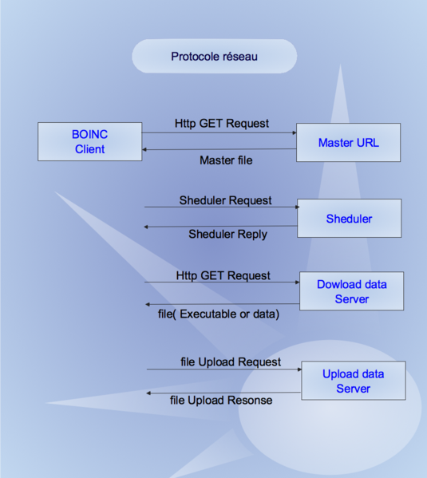

Etat de l'art
==========================

Nous citerons ici la description d'un des projet de "Network Computing" appelé BOINC. Il existe toutefois d'autres projets de supercomputing dans le monde.

BOINC
-----

BOINC est l'acronyme de Berkeley Open Infrastructure for Network Computing (Infrastructure non propriétaire de Berkeley dédiée au calcul en réseau).
BOINC est une plate-forme de calcul partagé. C'est donc un programme qui permet de faire participer des volontaires à des projets scientifiques susceptibles de faire avancer la science dans différents domaines tels que la médecine, l'astronomie, la physique ou les mathématiques.

BOINC a une puissance totale moyenne de calcul d'environ 6,5 PFLOPS repartie sur environ 800 000 ordinateurs en septembre 2012 (pour comparaison, le supercalculateur le plus puissant à la même époque est le Sequoia d'IBM, qui atteint une puissance de 16,324 PFLOPS).

Principe de fonctionnement 
-------------------------

La plate-forme BOINC suit un modèle simple : chaque projet s'étend sur un serveur central qui exécute une application Master. Les applications sont réparties sur des milliers de petites tâches qui sont envoyées à des machines réparties sur l'Internet, où ils exécutent des applications de type travailleurs. Il n'y a pas de communication entre les travailleurs. Toutes les communications doivent être du travailleur au Maitre, afin de permettre la traversée de NAT et pare-feu. Les applications BOINC sont donc limitées au modèle Master/worker, avec un serveur central chargé de distribuer le travail aux clients BOINC. BOINC suit un protocole de réseau simple, qui demande aux clients d'initier toutes les communications (problèmes de NAT/pare-feu) et de communiquer avec le serveur à chaque fois qu'un client demande plus de travail. Chaque fois qu'un client est inactif et décide d'exécuter plus de travail, il doit contacter le serveur principal trois fois.

