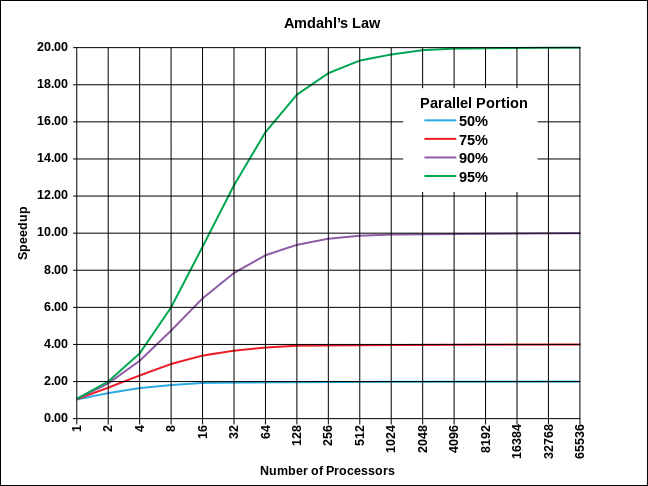

Etat de l'art
==========================

Les premiers ordinateurs étaient séquentiels, exécutant les instructions l'une après l'autre. Le parallélisme se manifeste actuellement de plusieurs manières : en juxtaposant plusieurs processeurs séquentiels ou en exécutant simultanément des instructions indépendantes.

Différents types de parallélisme : la taxinomie de Flynn
--------------------------------------------------------

La taxinomie de Flynn, proposée par l'américain Michael J. Flynn est l'un des premiers systèmes de classification des ordinateurs créés. Les programmes et les architectures sont classés selon le type d'organisation du flux de données et du flux d'instructions.

*Les machines les plus simples traitent une donnée à la fois : ces systèmes sont dits « séquentiels ». Ce type de fonctionnement était prédominant pour les ordinateurs personnels jusqu'à la fin des années 1990. On parle d'architectures SISD (Single Instruction, Single Data).
*Les systèmes traitant de grandes quantités de données d'une manière uniforme ont intérêt à être des SIMD (Single Instruction, Multiple Data) ; c'est typiquement le cas des processeurs vectoriels ou des unités de calcul gérant le traitement du signal comme la vidéo ou le son.
*Les systèmes utilisant plusieurs processeurs ou un processeur multi-cœur sont plus polyvalents et pleinement parallèles, ce sont des MIMD (Multiple Instructions, Multiple Data).
*Le type MISD a été beaucoup plus rarement utilisé, il semble néanmoins adapté à certains problèmes comme les réseaux neuronaux et aux problèmes temps-réel liés. L'architecture appelée Systolic array est un type d'architecture MISD.

Efficacité du parallélisme
--------------------------

Représentation graphique de la loi d'Amdahl. L'accélération du programme par la parallélisation est limitée par le nombre d'exécutions parallèles possible au sein de l'algorithme. Par exemple, si un programme peut être parallélisé à 90 %, l'accélération maximale théorique sera de x 10, quel que soit le nombre de processeurs utilisés.
