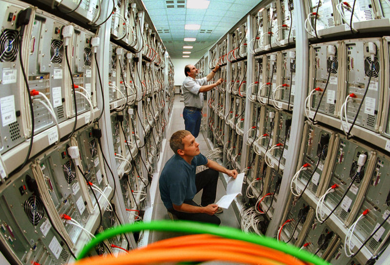
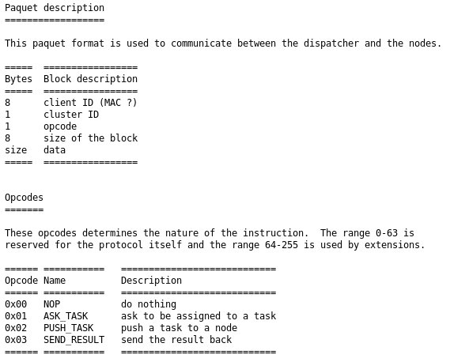

Architecture envisagée
======================

Note préalable
--------------

Bien que nous ayons mûrement réfléchi sur l'architecture que nous allions
mettre en place nous ne pouvons garrantir que le projet final sera implémenté
tel que nous l'envisageons actuellement : de nouvelles idées peuvent émerger et
les benchmark vont très probablement nous permettre d'obtenir énormément
d'informations nous permettant de faire évoluer notre système.

Architecture système du cluster
-------------------------------

Nous avons décidé de réaliser un système de parallélisation de tâche destiné à
fonctionner en réseau, sur plusieurs machines. Celui-ci sera basé sur deux
types de machines : le dispatcher (ou le maître), chargé de séquencer et
d'organiser les différentes étapes de calcul et les noeuds (ou les esclaves)
qui effectuent des tâches.

### Les noeuds de calcul

Les noeuds seront chargés d'effectuer les tâches envoyées par le dispatcher,
puis de faire remonter le résultat associé à chaque tâche.

#### Contraintes

  * Les disques durs étant coûteux et les temps d'accès long, le système d'exploitation doit pouvoir être chargé entièrement en RAM et fonctionner sans disque dur.
  * Le dispatcher doit avoir possibilité de contrôler l'ensemble des noeuds facilement (reboot, vérification de l'état, ...)
  * Le kernel doit permettre de multi-threader les processus pour tirer profit
    des processeurs multi-coeurs
  * La stabilité du noeud importe peu, en cas d'erreur ou de crash du kernel le
    protocole sera capable de remettre le noeud en fonctionnement

Pour ces raisons nous nous orienterons probablement sur une distribution
linux sur mesure minimaliste comprenant le kernel et le strict minimum (libc,
un shell et quelques binaires tout au plus).

### Le dispatcher

Le dispatcher a pour rôle d'organiser les tâches nécessaire au calcul. Il va
donc répartir le travail entre chaqun des noeuds et récupérer les différents
résultats.

L'architecture système du dispatcher est beaucoup moins stricte que celle des
noeuds de calcul : il n'est pas en soit un goulot d'étranglement pour la
vitesse de calcul et il n'y en a qu'un seul par cluster.

Nous développerons donc un dispatcher fonctionnant sur Linux. Il offrira la
possibilité de sauvegarder les tâches déja calculées pour reprendre le calcul
en cas d'interruption.

Schedulding des tâches
----------------------

Le dispatcher tiendra à jour une liste des tâches.

Nous penchons pour l'instant sur un round robin avec une simple liste 
circulaire. Cette liste comprendra un nombre statique de tâches et sera 
remplie au fur et à mesure. A chaque fois qu'une tâche est distribuée, nous 
passerons à la suivante. Cela permet, si un noeud ne répond pas, de 
réattribuer la tâche plus tard.

Lorsque le dispatcher reçoit un résultat, il enlève la tâche correspondante de
la liste et il ajoute à la "fin" de la liste circulaire (c'est à dire juste 
avant l'élement pointé) une nouvelle tâche qui sera distribuée prochainement.

Ce schedulding est minimaliste et servira de "prototype". Nous nous réservons
la possibilité de le faire évoluer pour gagner en performance en rajoutant
nottament des options de timeout et de priorité d'execution.

Protocole réseau
----------------

Nous utiliserons un protocole qui ne permet pas de communication entre les
noeuds pour faciliter le schedulding des tâches.

Le dispatcher contrôlera l'ensemble des nodes et pourra les faire rebooter,
suivre leur activité.

Il s'occupera de distribuer les tâches à chaque fois qu'un noeud lui demande.

Lorsqu'un noeud est inactif, il demandera une tâche via un packet réseau, et le 
dispatcher répondra en envoyant une tâche à effectuer et des paramètres pour
l'execution. Une fois le résultat calculé il remontera le résultat au
dispatcher et le noeud sera à nouveau considéré comme inactif (voir les
spéficitations détaillées du protocole).

