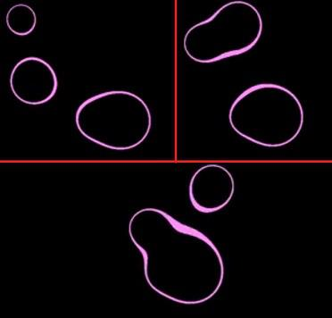
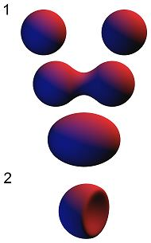

\newpage {}

## MetaBalls

les metaballs autrement appelés en français : "objets mous", sont utilisés en
infographie pour créer des formes organiques ou représenter des fluides. les
metaballs les plus courantes sont celles à 3 dimensions mais celles ci peuvent
s'étendre à N dimensions.
Chaque metaball est définie par sa fonction associé f(x,y,z). Cette fonction
retourne un scalaire et permet de définir un champ scalaire. Une valeur de
sueil est choisie pour délimiter la surface de la metaball. 

$$\sum_{i=0}^n metaball_i(x,y,z) \le seuil$$

Cette fonction calcule si un point (x,y,z) donné se trouve se trouve à
l'intérieur d'une metaballs.

Une fonction typique pour des metaballs est 

$$f(x,y,z) = \frac{1}{(x-x_0)^2 + (y-y_0)^2 + (z-z_0)^2}$$

où (x0,y0,z0) est le centre de la metaball. La division rend cette fonction
lente à calculer c'est pourquoi nous avons eu l'idée de paralléliser cette
tâche.

Nos metaballs ne fonctionnent actuellement qu'en 2D.

